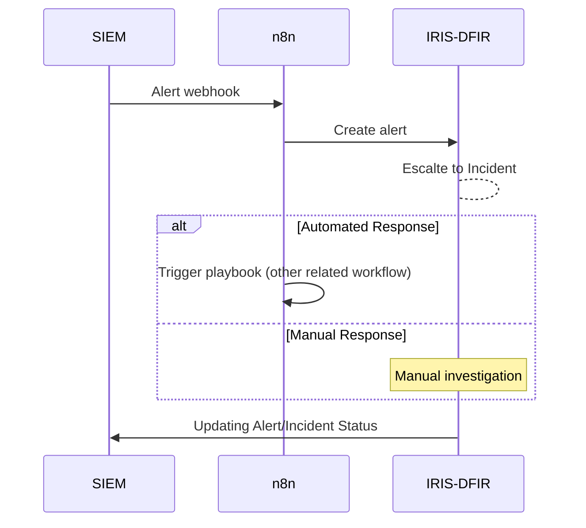

> **_Warning_** This method doesn't count your SIEM, SecOps may require it but choosing a SIEM product is in your budget, I can't provide any good+free SIEM for you.
{: .prompt-warning }

```mermaid
sequenceDiagram
    participant SIEM as SIEM
    participant n8n as n8n
    participant IRIS as IRIS-DFIR

    SIEM->>n8n: Alert webhook
    n8n->>IRIS: Create alert
    IRIS-->IRIS: Escalte to Incident

    alt Automated Response
        n8n->>n8n: Trigger playbook (other related workflow)
    else Manual Response
        Note over IRIS: Manual investigation
    end

    IRIS->>SIEM: Updating Alert/Incident Status
```